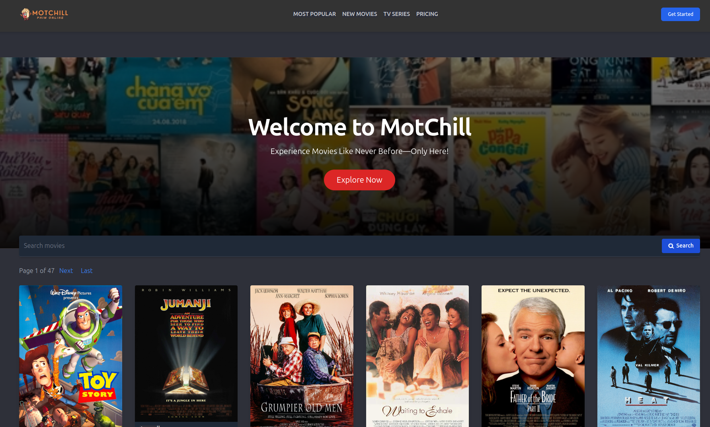

# MotChill - Movie Website

## Mô tả
MotChill là một hệ thống web quản lý nội dung phim (MovieSubscription) cho phép người dùng đăng ký tài khoản,
quản lý hồ sơ cá nhân, xem danh sách phim, xem chi tiết phim, quản lý danh sách phim yêu thích, đăng ký gói
dịch vụ, và thanh toán qua PayPal. Hệ thống phải hỗ trợ các chức năng cơ bản như xác thực người dùng, quản
lý hồ sơ, và xử lý các yêu cầu liên quan đến phim và đánh giá phim.



## Hướng dẫn sử dụng

### Yêu cầu

Trước khi bắt đầu, hãy đảm bảo rằng bạn đã cài đặt các phần mềm sau trên hệ thống của mình:

- **Git**: [Cài đặt Git](https://git-scm.com/book/en/v2/Getting-Started-Installing-Git)
- **Docker**: [Cài đặt Docker](https://docs.docker.com/get-docker/)

### Cài đặt

1. **Clone Repository**

   Sử dụng Git để clone repository về máy tính của bạn:

   ```bash
   git clone https://github.com/DucDM2202/Movie_Web.git

2. **Di chuyển đến Thư mục Dự án**
   
   Chuyển đến thư mục gốc của dự án:
   
   ```bash
   cd Movie_Web
4. **Build Docker Image**

   Sử dụng Docker để build image cho ứng dụng MotChill:
   
   ```bash
   docker build -t motchill-app .
   
### Chạy ứng dụng

1. **Chạy Docker Container**

   Khởi động container bằng lệnh sau:

   ```bash
   docker run -p 8000:8000 motchill-app
2. **Truy cập Ứng dụng**

   Mở trình duyệt web và truy cập:

   ```bash
   http://127.0.0.1:8000
